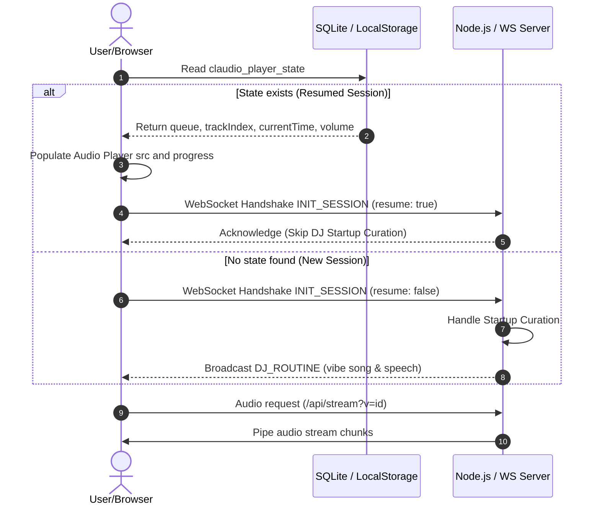
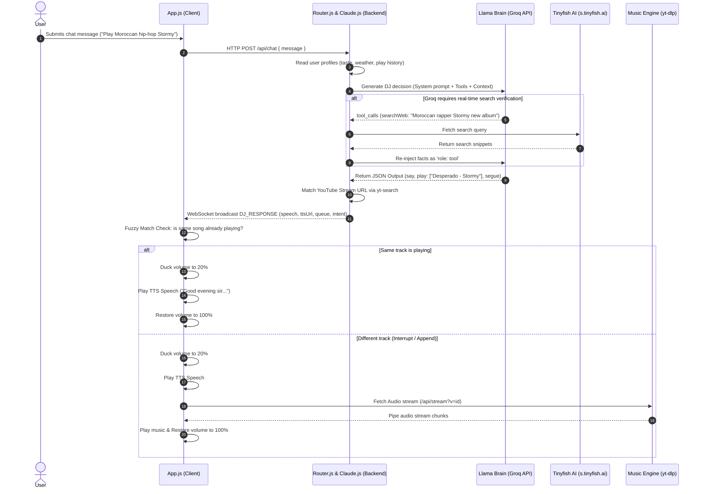

# 📐 Claudio FM Pro: Technical Architecture Deep-Dive

Welcome to the architectural specifications and engineering breakdown of **Claudio FM Pro**. Claudio is designed as a **Living Radio Station**—a stateful, real-time cybernetic broadcast ecosystem that marries deep language-model cognitive orchestration with zero-disk high-fidelity media pipelines.

This document serves as the absolute source of truth for the system's design, flows, memory states, recovery structures, and external API integrations.

---

## 🗺️ Table of Contents

- [1. High-Level System Overview](#1-high-level-system-overview)
- [2. The Real-time Network Protocol (WebSocket Handshakes)](#2-the-real-time-network-protocol-websocket-handshakes)
  - [2.1. Handshake Flow (Initialization & Resumption)](#21-handshake-flow-initialization--resumption)
- [3. Browser-to-Backend State Recovery Pipeline](#3-browser-to-backend-state-recovery-pipeline)
  - [3.1. LocalStorage Schema & Hydration](#31-localstorage-schema--hydration)
  - [3.2. Startup Curation Bypassing](#32-startup-curation-bypassing)
- [4. Zero-Storage Streaming Engine](#4-zero-storage-streaming-engine)
  - [4.1. Process Pipeline (yt-dlp ➡️ FFmpeg ➡️ Express)](#41-process-pipeline-yt-dlp-️-ffmpeg-️-express)
  - [4.2. Memory Management & Signal Handling](#42-memory-management--signal-handling)
- [5. Cognitive Routing & Tinyfish AI Web Search Tool](#5-cognitive-routing--tinyfish-ai-web-search-tool)
  - [5.1. Multi-Turn Tool Call & Context Re-injection](#51-multi-turn-tool-call--context-re-injection)
- [6. The Resilience & Recovery Boundaries](#6-the-resilience--recovery-boundaries)
  - [6.1. Groq JSON Generation Fallbacks](#61-groq-json-generation-fallbacks)
  - [6.2. The Failed-Generation Substring Recovery Boundary](#62-the-failed-generation-substring-recovery-boundary)
- [7. Advanced Broadcast Orchestration Details](#7-advanced-broadcast-orchestration-details)
  - [7.1. Fuzzy Similarity Check Algorithm](#71-fuzzy-similarity-check-algorithm)
  - [7.2. Professional Audio Ducking & Segues](#72-professional-audio-ducking--segues)
- [8. Relational Persistence Schema (SQLite)](#8-relational-persistence-schema-sqlite)
- [9. Visual Sequence Diagrams](#9-visual-sequence-diagrams)
  - [9.1. Global Initialization and Resumption Sequence](#91-global-initialization-and-resumption-sequence)
  - [9.2. Interactive Chat Curation, Tool Call, & Segue Sequence](#92-interactive-chat-curation-tool-call--segue-sequence)

---

## 1. High-Level System Overview

Claudio FM Pro utilizes a decoupled, event-driven client-server architecture. The server acts as a cognitive coordinate planner, database hub, and transcoding stream orchestrator. The client acts as a high-fidelity playback board, visualizer renderer, and session keeper.

```
       ┌────────────────────────────────────────────────────────┐
       │                   CLIENT WEB BROWSER                   │
       │                                                        │
       │   ┌──────────────────┐          ┌──────────────────┐   │
       │   │  HTML5 Audio/TTS │◄─────────┤  State Hydrator  │   │
       │   └────────┬─────────┘          └────────▲─────────┘   │
       │            │                             │             │
       │   ┌────────▼─────────┐          ┌────────┴─────────┐   │
       │   │ Canvas Visualizer│          │   LocalStorage   │   │
       │   └──────────────────┘          └──────────────────┘   │
       │            ▲                             ▲             │
       └────────────┼─────────────────────────────┼─────────────┘
                    │ WebSocket                   │ HTTP REST
                    ▼                             ▼
       ┌────────────┴─────────────────────────────┴─────────────┐
       │                   NODE.JS WORKER NODE                  │
       │                                                        │
       │   ┌──────────────────┐          ┌──────────────────┐   │
       │   │ WebSocket Server │          │ Express API Host │   │
       │   └────────┬─────────┘          └────────┬─────────┘   │
       │            │                             │             │
       │   ┌────────▼─────────┐          ┌────────▼─────────┐   │
       │   │ Cognitive Router │          │   Stream Spawner │   │
       │   └────────┬─────────┘          └────────┬─────────┘   │
       │            │                             │             │
       │   ┌────────▼─────────┐          ┌────────▼─────────┐   │
       │   │   Groq LLM /     │          │  yt-dlp + FFmpeg │   │
       │   │  Deepgram TTS    │          └──────────────────┘   │
       │   └────────┬─────────┘                                 │
       │            ▼                                           │
       │   ┌──────────────────┐                                 │
       │   │  SQLite Database │                                 │
       │   └──────────────────┘                                 │
       └────────────────────────────────────────────────────────┘
```

---

## 2. The Real-time Network Protocol (WebSocket Handshakes)

Claudio FM Pro maintains a bidirectional state synchronization highway using standard WebSockets at route `/stream`. 

### 2.1. Handshake Flow (Initialization & Resumption)

When a client browser opens, the WebSocket connection immediately registers. A core structured handshake JSON is transmitted by the client to indicate session context:

#### New Session Handshake Message:
```json
{
  "type": "INIT_SESSION",
  "resume": false
}
```
*Action*: The server receives this and triggers **Startup Curation**—calling the cognitive router to select a song fitting the current location (e.g. Casablanca), local weather, time, and routines. It responds with a `DJ_ROUTINE` payload.

#### Resume Session Handshake Message:
```json
{
  "type": "INIT_SESSION",
  "resume": true
}
```
*Action*: The server recognizes an active restored playback state in the client browser. It bypasses cognitive startup curation to prevent disrupting the active music stream.

---

## 3. Browser-to-Backend State Recovery Pipeline

### 3.1. LocalStorage Schema & Hydration

To combat browser refresh events, network dropping, or accidental tab closures, the client implements a **Continuous State Hydration** process. Every time the audio tracks play, time updates, or volume changes, the browser updates a key in `localStorage` called `claudio_player_state`.

#### LocalStorage JSON Schema:
```json
{
  "queue": [
    {
      "id": "videoId_1",
      "name": "Song Name",
      "artist": "Artist Name",
      "album": "Global Stream Source",
      "cover": "https://img.youtube.com/vi/...",
      "url": "/api/stream?v=videoId_1"
    }
  ],
  "currentTrackIndex": 0,
  "isPlaying": true,
  "currentTime": 45.32,
  "volume": 80
}
```

### 3.2. Startup Curation Bypassing

During page load, `loadPlayerState()` is invoked:
1. It attempts to parse `claudio_player_state`.
2. If validated, it loads the `queue`, sets `currentTrackIndex`, restores the volume slide, and points `audioPlayer.src` to the saved track URL.
3. It sets `audioPlayer.currentTime` to the precise time coordinates saved (e.g., `45.32`).
4. It sets the flag `isResumedSession = true`.
5. When the user ignites the overlay, the WebSocket initialization sends `resume: true`.

---

## 4. Zero-Storage Streaming Engine

Traditional streaming architectures download entire audio files to local server directories before streaming them to clients. This wastes considerable disk IO and storage. Claudio utilizes an advanced on-the-fly streaming pipeline.

### 4.1. Process Pipeline (yt-dlp ➡️ FFmpeg ➡️ Express)

When the client requests `/api/stream?v={videoId}`, the server launches a zero-disk sub-process pipe:

```
[YouTube Cloud] 
       │ HTTP Chunk Download
       ▼
  [yt-dlp Process] 
       │ Stdout raw audio chunks (spit on-the-fly)
       ▼ (Unix / Windows pipe)
  [ffmpeg Process] (transcodes to mp3, 128kbps, lame codec)
       │ Stdout mp3 chunked stream
       ▼
 [Express Response] 
       │ Transfer-Encoding: Chunked HTTP stream
       ▼
[Browser HTML5 Audio]
```

### 4.2. Memory Management & Signal Handling

Because processes are spawned on-the-fly per stream, process cleaning is critical to prevent CPU resource leakage:
*   **SIGTERM Cleanups**: The Express request listener registers a `close` callback:
    ```javascript
    req.on('close', () => {
      ytdlp.stdout.unpipe(ffmpeg.stdin);
      ffmpeg.stdout.unpipe(res);
      ytdlp.kill('SIGTERM');
      ffmpeg.kill('SIGTERM');
    });
    ```
*   **EPIPE Crashes Guard**: To prevent the Node.js event loop from crashing when the FFmpeg pipeline is abruptly killed during track skips, the server implements an explicit input error listener on FFmpeg's `stdin`:
    ```javascript
    ffmpeg.stdin.on('error', (err) => {
      if (err.code !== 'EPIPE') console.error(err);
    });
    ```

---

## 5. Cognitive Routing & Tinyfish AI Web Search Tool

When user inputs are submitted via `/api/chat` or triggered through background automation, the system queries the Groq API (powered by `meta-llama/llama-4-scout-17b-16e-instruct`).

### 5.1. Multi-Turn Tool Call & Context Re-injection

The cognitive engine is equipped with the `searchWeb` tool via **Tinyfish AI s.tinyfish.ai**. This allows it to check music facts on-the-fly.

```
┌───────────┐         User Question          ┌──────────┐
│   User    ├───────────────────────────────►│  Server  │
└───────────┘                                └────┬─────┘
                                                  │ Post request with Tools definitions
                                                  ▼
┌───────────┐       Need artist context      ┌──────────┐
│   Groq    │◄───────────────────────────────┤  Server  │
│   Brain   │                                └────┬─────┘
└─────┬─────┘                                     │
      │ tool_calls: [ { name: "searchWeb", query: "..." } ]
      ▼
┌───────────┐      HTTP GET s.tinyfish.ai        ┌──────────┐
│  Server   ├───────────────────────────────►│ Tinyfish AI  │
└─────┬─────┘                                └────┬─────┘
      │                                           │
      │ 4 clean search result objects             │
      ◄───────────────────────────────────────────┘
      ▼
┌───────────┐       Re-inject search results ┌──────────┐
│   Server  ├───────────────────────────────►│   Groq   │
└───────────┘       to Groq with 'role: tool'└────┬─────┘
                                                  │
                                                  ▼
┌───────────┐         Valid JSON output      ┌──────────┐
│   User    │◄───────────────────────────────┤  Server  │
└───────────┘                                └──────────┘
```

---

## 6. The Resilience & Recovery Boundaries

Groq models optimized for speed sometimes experience structure degradation when forced to return complex JSON schema types or during native tool execution. Claudio has three strict **Recovery Boundaries** to ensure 100% uptime.

### 6.1. Groq JSON Generation Fallbacks

If the first Llama response fails to parse as valid JSON:
1. The error catch boundary captures the failure.
2. It initiates a secondary, ultra-rapid completion call with a temperature of `0.2` (for high determinism).
3. The prompt feeds the raw, malformed response to the helper formatting LLM and mandates strict extraction into the valid schema format.
4. The output is parsed and served immediately.

### 6.2. The Failed-Generation Substring Recovery Boundary

When tool completions or structural conversions throw a `failed_generation` exception on the Groq API, the error payload contains the partially created text. Claudio implements a regex recovery script in `src/claude.js`:

```javascript
const failedGen = err.response?.data?.error?.failed_generation;
if (failedGen) {
  let cleanGen = failedGen.trim();
  const firstBrace = cleanGen.indexOf('{');
  const lastBrace = cleanGen.lastIndexOf('}');
  // Extract and parse only the JSON substring boundaries
  if (firstBrace !== -1 && lastBrace !== -1 && lastBrace > firstBrace) {
    const jsonSubStr = cleanGen.substring(firstBrace, lastBrace + 1);
    return JSON.parse(jsonSubStr);
  }
}
```

This ensures that even in an API crash state, the system successfully extracts partial curated tracks and plays them.

---

## 7. Advanced Broadcast Orchestration Details

### 7.1. Fuzzy Similarity Check Algorithm

When a user chats with Claudio, their intent is evaluated. If the user asks for a song that is *already playing*, we must **not** restart the song and disrupt the listener. The client performs an advanced word-token intersection check `areTracksSimilar()`:

```javascript
function areTracksSimilar(t1, t2) {
    if (!t1 || !t2) return false;
    if (t1.id === t2.id) return true;
    
    const cleanStr = (str) => {
        return str.toLowerCase()
                  .replace(/[\(\)\[\]\-+\|]/g, ' ') // Strip special characters
                  .replace(/\s+/g, ' ')             // Standardize spacing
                  .trim();
    };
    
    const n1 = cleanStr(t1.name);
    const n2 = cleanStr(t2.name);
    
    if (n1.includes(n2) || n2.includes(n1)) return true;
    
    const words1 = n1.split(' ').filter(w => w.length > 2); // Exclude stop words
    const words2 = n2.split(' ').filter(w => w.length > 2);
    if (words1.length === 0 || words2.length === 0) return false;
    
    // Check overlapping meaningful words
    const intersection = words1.filter(w => words2.includes(w));
    return intersection.length >= 2; // Match threshold
}
```

If similar, instead of executing `stopEverything()` and initiating a track switch, it performs **Audio Ducking** and speaks over the existing track context dynamically.

### 7.2. Professional Audio Ducking & Segues

Our real-time audio board simulates a real radio channel:
1. **Ducking Trigger**: Upon receiving a TTS URL via WS, `playTTS` captures the current volume of the standard audio track.
2. **Smooth Fade**: It immediately drops the music's volume to `originalVolume * 0.2` (20% audio background).
3. **Transmission**: The `ttsPlayer` streams and speaks Claudio's introduction speech (Aura voice).
4. **Restoration**: Upon completion of `ttsPlayer.onended`, the volume of the primary `audioPlayer` smoothly returns to `100%`.

---

## 8. Relational Persistence Schema (SQLite)

Claudio uses a light, localized SQLite relational database (`state.db`) to retain system memory.

### Table: `plays` (Broadcast Play History)
Holds chronological track list plays.
| Column | Type | Constraints | Description |
| :--- | :--- | :--- | :--- |
| `id` | INTEGER | PRIMARY KEY AUTOINCREMENT | Unique record ID |
| `song_name` | TEXT | - | The title of the song played |
| `artist` | TEXT | - | The song's publisher/artist |
| `played_at` | DATETIME | DEFAULT CURRENT_TIMESTAMP | Precise broadcast time |

### Table: `messages` (Chat & DJ Logs)
Stores standard memory for LLM conversational historical context.
| Column | Type | Constraints | Description |
| :--- | :--- | :--- | :--- |
| `id` | INTEGER | PRIMARY KEY AUTOINCREMENT | Message ID |
| `role` | TEXT | - | either `'user'` or `'claudio'` |
| `content` | TEXT | - | The actual text context of the message |
| `created_at` | DATETIME | DEFAULT CURRENT_TIMESTAMP | Insertion timestamp |

### Table: `likes` (User Tastes)
Persistent storage of music elements marked with hearts.
| Column | Type | Constraints | Description |
| :--- | :--- | :--- | :--- |
| `id` | INTEGER | PRIMARY KEY AUTOINCREMENT | Record ID |
| `song_name` | TEXT | - | Liked song name |
| `artist` | TEXT | - | Liked artist name |
| `liked_at` | DATETIME | DEFAULT CURRENT_TIMESTAMP | Record save timestamp |

---

## 9. Visual Sequence Diagrams

### 9.1. Global Initialization and Resumption Sequence

Below is the state sequence detailing browser-to-backend socket connections and LocalStorage state restorations.



### 9.2. Interactive Chat Curation, Tool Call, & Segue Sequence

This sequence details the user-driven chat transaction, showing context compilation, Groq tool decisions via Tinyfish AI, fuzzy verification checks, ducking, and transmission processes.



---

**End of Architectural Specification. Documentation maintained by the Claudio FM Core Contributors.**
