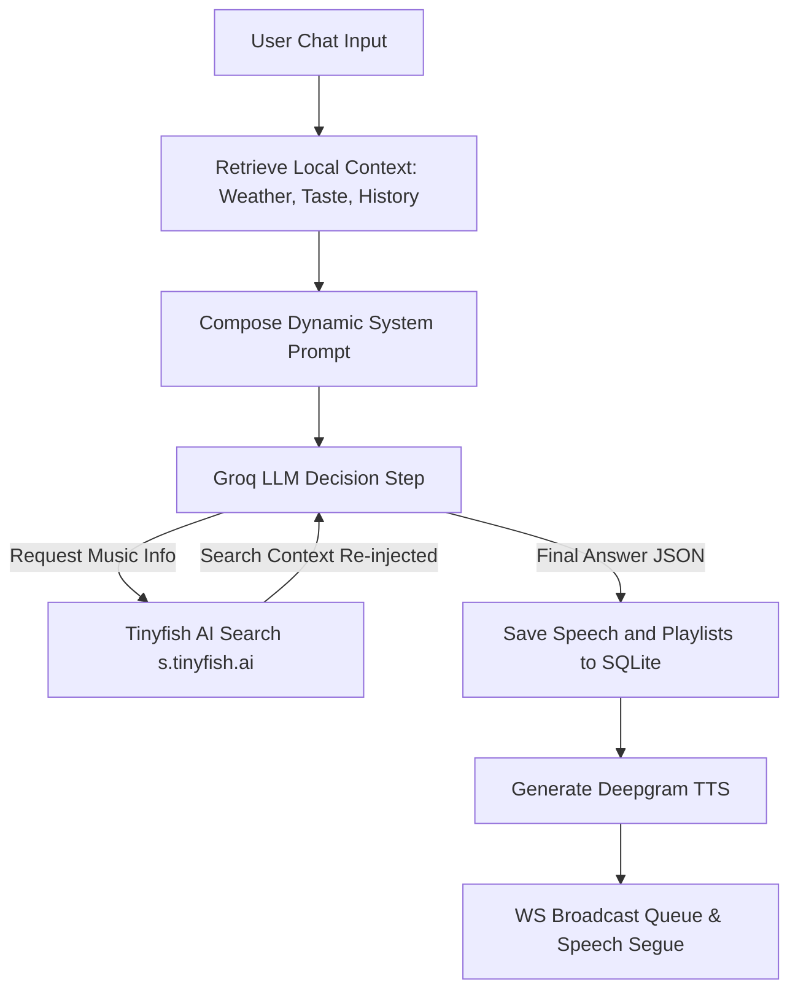

# 📻 Claudio FM Pro: Neural AI Radio Intelligence

<p align="center">
  
</p>

<p align="center">
  <strong>"It's 21:00 in Casablanca, and the airwaves just got a lot smarter."</strong>
</p>

<p align="center">
  <a href="#-technical-architecture-deep-dive"></a>
  <a href="#-installation--setup"></a>
  <a href="#-contributing"></a>
</p>

---

## 🎙️ The Concept: A "Living Radio" Station

**Claudio FM Pro** is a state-of-the-art, fully autonomous AI DJ and radio broadcasting system. Unlike traditional audio streaming shufflers or music players, Claudio is a continuous, stateful media pipeline. He acts as an intelligent host that analyzes time, regional weather, personal schedules, and historically logged listener reactions to curate and host custom broadcasts on-the-fly.

Claudio broadcasts using professional, hardware-inspired, and color-dynamic interfaces designed for both high-end desktops and tablet boards. The station represents the future of personal media consumption: combining **on-the-fly streaming transcoding** with **advanced Generative AI reasoning**, **natural TTS speech transitions**, and **zero local disk footprint**.

---

## 🎨 Professional Glassmorphic Dashboard

Claudio’s frontend is a desktop-optimized, iPad-responsive dashboard styled with a premium Cyberpunk-meets-HiFi glassmorphic look:

*   **Mood Color Synchronization**: The system extracts the dominant color from the album artwork of whatever track is currently playing using a rapid browser-side 1x1 canvas color extractor. It instantly updates the system's global accent color variables and adds a custom neon glow throughout the UI.
*   **Reactive Equalizer Visualizer**: Visual equalizer bar indicators dance dynamically in sync with the audio track streams to represent live signal transmissions.
*   **Widescreen Telemetry Display**: A massive digital clock, active day-date labels, a real-time glowing "ON AIR / DJ TRANSMITTING" telemetry terminal, and live scrolling glass console logs.
*   **Session State Recovery**: Built-in player resumption preserves your queue, track positions, progress times, and volume configurations across reloads or accidental browser tab crashes.

---

## ⚡ Core Technical Capabilities

### 🧠 **Cognitive Curation Brain (Groq API)**
Powered by **Llama 4 Scout** (`meta-llama/llama-4-scout-17b-16e-instruct`), Claudio is context-aware. He parses:
*   Your music tastes (`taste.md`) and customized listening routines (`routines.md`).
*   The current weather of your configured city (Casablanca, Paris, or Tokyo).
*   The exact time of day (shaping high-tempo morning wakes vs. slow-tempo lo-fi reflective evenings).
*   Your history of liked/hearted tracks, ensuring he learns what makes you tick while introducing fresh recommendations.

### 🎙️ **Deepgram Aura TTS Speech Transmissions**
Claudio speaks like a professional, late-night radio host. Utilizing **Aura-Asteria-En** high-performance voice generation, his speeches are stripped of brackets, cached locally for instant access, and ducked smoothly over background tracks.

### 🔌 **Zero-Disk Cloud Streaming Pipeline**
Instead of pre-downloading music tracks onto the server and wasting storage, Claudio spawns dynamic shell sub-processes. It grabs the best YouTube audio stream on-the-fly via `yt-dlp` and pipes it into `ffmpeg` to encode a 128kbps LAME MP3 stream directly to the Express response chunked stream in near-zero latency.

### 🔍 **Fuzzy-similarity Logic & Skip Handling**
*   **Fuzzy Duplication Protection**: Checks if a requested song matches the actively playing track by running token-word intersection checks on clean titles, preventing disruptive song restarts.
*   **Interactive skip trigger**: Skipping when the queue is exhausted commands Claudio to automatically scan the web for fresh, vibe-fitting tunes to extend your session.

---

## 🧱 The Technology Stack

| Component | Technology | Role |
| :--- | :--- | :--- |
| **Language Model** | Groq (`Llama 4 Scout / 70B Versatile`) | System Brain & Playlist Curator |
| **Web Research** | Tinyfish AI Search API (`s.tinyfish.ai`) | Real-time Discography & Artist Fact Verification |
| **Voice Generator** | Deepgram Aura (`aura-asteria-en`) | Conversational DJ Speech Transmissions |
| **Media Fetcher** | `yt-dlp` CLI | Live Streaming Cloud Source Audio Scraper |
| **Transcoder** | `ffmpeg` CLI (libmp3lame) | Raw Audio to 128kbps MP3 Real-Time Encoder |
| **Local Database** | SQLite3 | Plays, Conversation History, & Likes Persistence |
| **Background Tasks**| `node-cron` | Schedules 07:00 Morning and Hourly Context Updates |
| **Real-time Layer** | WebSockets (`ws` library) | Instant DJ Audio & Metadata Sync |
| **Frontend Board** | HTML5 Canvas, Vanilla JS, Tailwind CSS | Telemetry Dashboard & Canvas Color Extractor |

---

## 📐 Technical Architecture Deep-Dive

For a comprehensive review of state flows, WebSocket protocols, model recovery schemes, database schemas, and visual diagrams, navigate to the [ARCHITECTURE.md](file:///c:/Users/hiba/Desktop/claudio/ARCHITECTURE.md) file.

### Streaming Process Flow:


### Cognitive Brain Decision Loop:


---

## ⚙️ Installation & Setup

### 1. System Requirements & Prerequisites

Ensure the following dependencies are installed and properly registered in your system’s execution environments:

*   **Node.js**: `v18.0.0` or higher.
*   **FFmpeg**: Must be available globally. Verify by running `ffmpeg -version` in your terminal.
*   **yt-dlp**: Latest version recommended. Verify by running `yt-dlp --version`.

---

### 2. Quick Ignition

1.  **Clone the Repository**:
    ```bash
    git clone https://github.com/your-username/claudio-fm.git
    cd claudio-fm
    ```

2.  **Install Node Modules**:
    ```bash
    npm install
    ```

3.  **Setup Environment Variables**:
    Create a `.env` file in the root directory by copying the example:
    ```bash
    cp .env.example .env
    ```

4.  **Edit your `.env` File**:
    Fill in your API keys as detailed below:
    ```env
    # Host Port configuration
    PORT=8080
    CITY=Casablanca

    # AI Cognitive Brain (Groq API)
    GROQ_API_KEY=gsk_your_key_here
    GROQ_MODEL=meta-llama/llama-4-scout-17b-16e-instruct

    # Voice Engine (Deepgram API)
    DEEPGRAM_API_KEY=your_deepgram_key_here

    # Contextual Real-Time Weather (OpenWeather API)
    OPENWEATHER_API_KEY=your_weather_key_here

    # Web Research Engine (Tinyfish AI API)
    TINYFISH_API_KEY=tinyfish_your_key_here
    ```

5.  **Ignite the Station**:
    ```bash
    node server.js
    ```
    Your living radio station is now **ON AIR** at `http://localhost:8080`.

---

## 🗺️ System Roadmap

*   [ ] **STT Speech Control**: Integration with Deepgram Speech-to-Text, enabling users to speak back to the console hands-free.
*   [ ] **Seamless Dual-Channel Crossfading**: Adding dual audio player pipelines in the client to allow cross-fades during song switches.
*   [ ] **Ambient Soundbeds**: Playing quiet background rain patterns or coffee shop ambient audio during active DJ conversational transmissions.
*   [ ] **Synchronized Party Listening**: Adding multi-room WebSockets to host live, fully synchronized radio listening rooms.

---

## 📜 Contributions & Guidelines

Want to help Claudio improve his airwaves? Review the detailed guidelines in the [CONTRIBUTING.md](file:///c:/Users/hiba/Desktop/claudio/CONTRIBUTING.md) file. We adhere to semantic commit messages, structured error handling boundaries, and zero-disk process leak checks.

---

## 📄 License

This project is licensed under the terms of the MIT License. View the detailed terms in the [LICENSE](file:///c:/Users/hiba/Desktop/claudio/LICENSE) file.

---

**Built with ❤️ for the future of smart radio broadcasting.**
